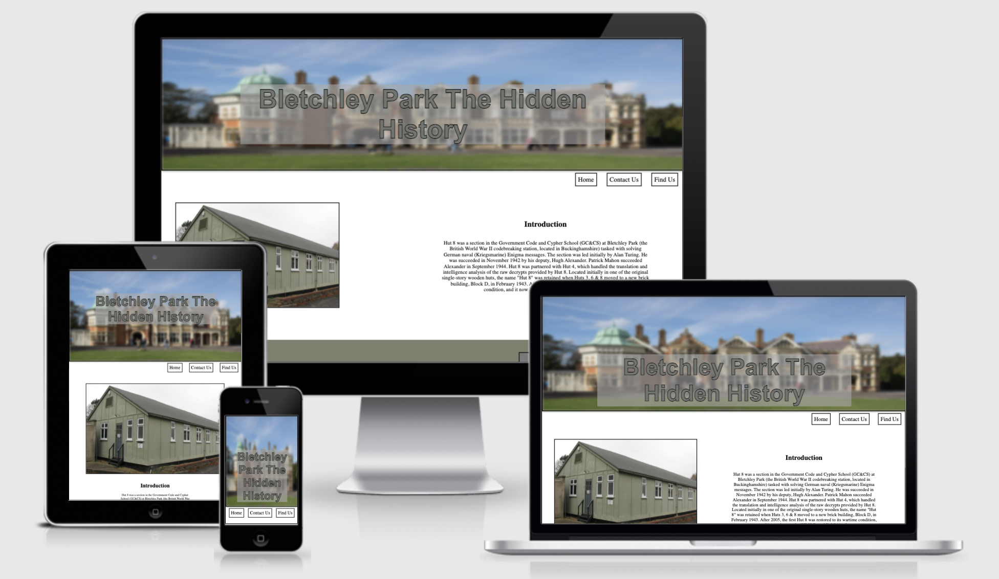
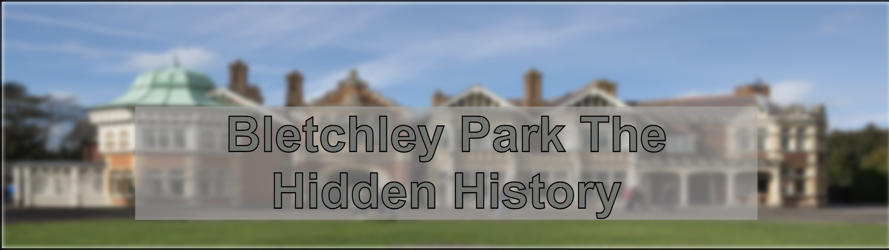
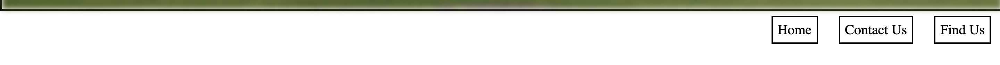
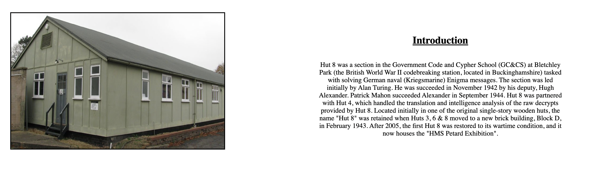
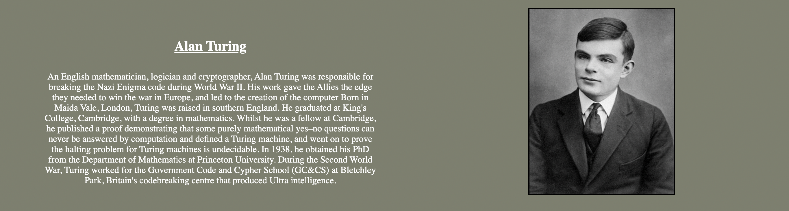
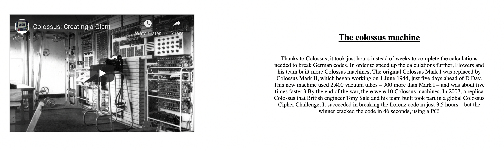
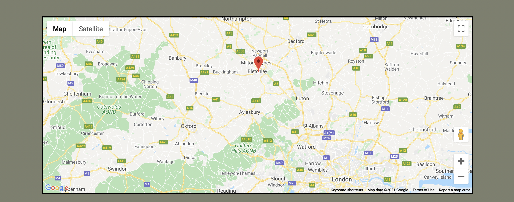
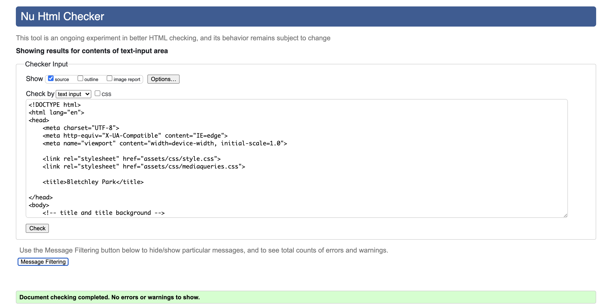
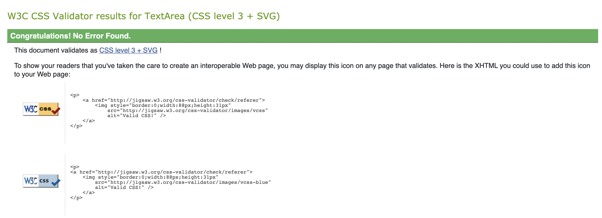

<h1>Bletchley Park The Hidden History</h1>

<p>Bletchley park the hidden history is a site that hopes to  acomplish shedding some light on the history behind bletchley manor and the important role it had in world war 2. I have created the site in such a way to target young adults that are interseted in computers and some of the history behind one of the most iconic computers in history. This site will be usefull to young adults as it has a simple but apealing layout and displays the informatiomn in an intuitive way.</p>
<br>


<h1>Features</h1>
<br>

<h2>Title and Image</h2>
<ul>
    <li>The title image is an image of bletchley mannor that has purposely been blured to add an element of uknown.</li>
    <li>The title purposely stand out from the background to counter the element of unknown and assuer the user there in the right place and can find what their looking for.</li>
</ul>


<br>
<h2>Navigation Bar</h2>
<ul>
    <li>The navigation bar is used to move between the two pages and the contact us section allowing for easy navigation of the site </li>
    <li>The built in features of the browser will also work with the website to make it even easier to navigate</li>
</ul>


<br>
<h2>Introduction section</h2>
<ul>
    <li>The introduction is just a brief paragrpah of history about the hut 8 team</li>
    <li>It is a good starting feature as it supplies the base knowladge for the rest of the page that goes a little deeper into certian parts of the history</li>
</ul>


<br>
<h2>Alan turing section</h2>
<ul>
    <li>This section give the user more indepth information about alan turing</li>
</ul>


<br>
<h2>Colossus section</h2>
<ul>
    <li>The colossus section has an embeded video about some of the people who orignially worked on the machine</li>
    <li>This section also has a small paragph with some information aswell incase the user doesnt have the time to watch the full video.</li>
</ul>


<br>
<h2>Contact us section</h2>
<ul>
    <li>The contact us section is there so anybody with questions that arent answered through the website you can contact us and get the answers to your questions.</li>
</ul>


<br>
<h2>Footer</h2>
<ul>
    <li>The footer bar is used for the links to different social media so you can keep up to date with any information or news about bletchley park.</li>
</ul>


<br>
<h2>Find Us Section</h2>
<ul>
    <li>The find us section uses and embeded map using js so that when the user wants to visit they can see exactly when bletchley park is located.</li>
</ul>


<h1>Testing</h1>
<h2>Navigation Feature:</h2>
<p>What was the intened use of this feature?</p>
    <ul>
        <li>The intended use of this feature was to be able to navigate through the webpage with ease. I ensured that they worked propperly by testing each anchor/link on each page making sure they all link to the correct place, for example making sure the "home" button on the nav bar always took the user back to the landing page no matter which page they were on.</li>
    </ul>

<br>
<h2>Introduction/turing/colossus Feature:</h2>
<p>What was the intened use of this feature?</p>
    <ul>
        <li>The intended use for the introduction feature was to give the user a brief description of the history of bletchley park so that the user can gain some basic knowledge before continuing down the page. I ensured the feature worked by using wikipedia to get a general description and then showing it to multiple people who have had no previous knowledge about bletchley park, and asked wether this information would allow them to build a basic understanding of what happened at bletchley park. all participents said that it was enough information. </li>
        <br>
        <li>The intended use for the turing feature was to shed a bit more light on the alan turings role in decoding the enigma and creating the colossus machine. i ensured this featured worked in the same way i ensured the introduction woudl work. i used the same controll group as before and only asked them the questions after i asked them / gave them the initial information.
        </li>
        <br>
        <li>The intened use for the colossus feature was to give a small amount of information about the colossus machine in the paragraph so that if the user didnt have enough time to watch the full video and take in all the information they would still be able to gain a basic understaning of what the colossus machine and what it did. I also added the video for the oposite reason. I ensured the features worked by splitting my control group in half and showing one half the video and the other half just the paragraph. Then asked each group wether the information given would give them a suitible undertanding about the hidden history of bletchley park in more detail. all participents answered yes there is enough information given to have a deeper understaing of what happened at bletchley park. </li>
    </ul>
<br>
<h2>Contact us feature:</h2>
<p>What was the intened use of this feature?</p>
    <ul>
        <li>The intened use of this feature was to allow the user to contact us and ask any question that cannot be answered with the information given. i have ensured this works by testing with multiple emails and question and every request is successfully sent to the codeinstitute form dump.</li>
    </ul>

<br>
<h2>Find us feature:</h2>
<p>What was the intened use of this feature?</p>
    <ul>
        <li>The intened use of this feature was to allow the user to easily find out where bletchley park is located and input the coordinates/location into there maps. I ensured this by using the same control group that had no previous knowledge of bletchley park and asked them to use the find us page to find out where it is and navigate to it using maps all using different starting points. all participents were able to location and get directions from there given start points.</li>
    </ul>

<h2>Different screen sizes:</h2>
<br>
<p> To get the different screen sizes to work and make my web page responsive i had to use whats called a media query</p>

```
@media screen and (max-width:400px){
    .title{
        font.size="24px"
    }
}
```
<p>I used these to chanage the css of each component at different screen sizes e.g. 1100px , 768px , 320px so that the structure of the webpage wouldn't break. <br>So for the screen size of a laptop i have the image and the paragraph next to each other so the flow of information goes from left to right, this is also true for screens bigger then a laptops such as a desktop.<br>For small screens such as tablets and phones i change the structure of the page to have the images above the paragraphs so the flow is more vertical then on the laptop/desktop.</p>

<h2>Validator Testing:</h2>
<h3>HTML validated</h3>

<h3>CSS validated</h3>


<h2>Deploment</h2>
<ul>
    <li>The site was deployed to GitHub pages. The steps to deploy follows:</li>
    <ul>
        <li>In the GitHub repository, navigate to settings tab</li>
        <li>From the source section drop-down menu, select the master branch</li>
        <li>Once the master branch has been selected, the pages will be automatically refreshed with a detialed ribbon display to indicate teh sucsessfull deployment.</li>
    </ul>
</ul>
<p>The live link cabe be found here - </p>

<h2>Credits</h2>

<h2>Media</h2>